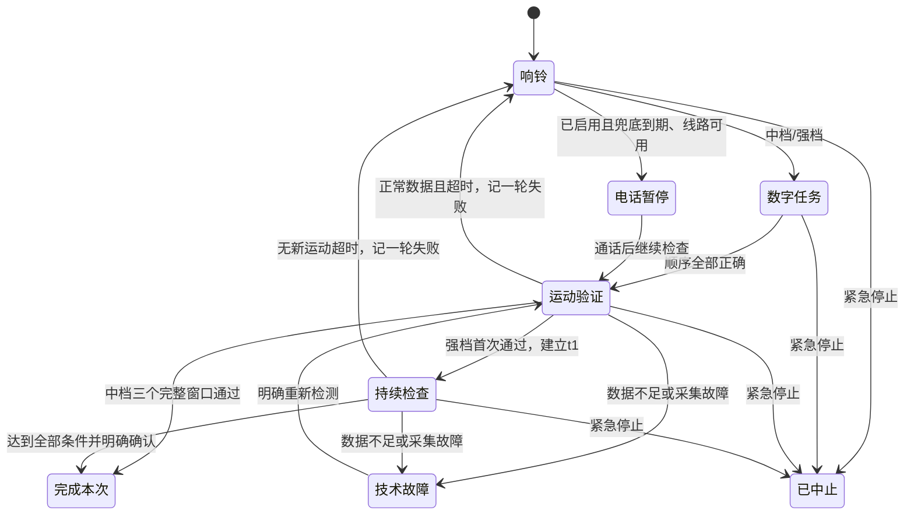

# 准点：首版行为规格

准点是无需账号、离线工作的原生 Android 日历和分级提醒。数据仅保存在本机；重要标记与提醒强度相互独立。状态机的“通过”表示完成本次检查，不证明本人已经清醒。运动参数是**待真机校准基线**，没有经过真实步行识别准确率验证。

## 日程与时间

- 安排包含标题、开始/结束、地点、备注、重要、启用、提前分钟数、强度和提醒参数快照。单次安排冻结实际开始/结束时刻；每周规则保存自己的 IANA 时区、当地时间、ISO 星期（周一为 1）和可选的含当日结束日期。默认时区 `Asia/Shanghai`。
- 设备换时区不改写规则。夏令时不存在的当地时间按时差向后移；重复出现的当地时间选择较早偏移。若向后移动开始时间使结束不晚于开始，则保留原本地时长补足结束。赶车时长按实际经过的分钟倒推。
- 每个实例 ID 为 `安排 ID@原始当地日期`。修改本次可移动时间，但保留实例 ID。跳过只排除该日期；修改本次及之后截断旧系列并创建新系列 ID；删除/禁用仅影响该安排。操作后的 OS 闹钟必须随之取消或重建。
- 保存前预览严格晚于当前时刻的下三次实际提醒时间。保存成功与系统接受闹钟注册是两个结果；注册成功也不是未来一定送达的承诺。恢复时不重播过期提醒。
- 赶车模板：目标到站＝发车－提前到站；最晚出门＝到站－路程；准备出门＝最晚出门－缓冲；起床＝准备出门－准备时长。输出四个可分别编辑、独立提醒的节点。未推算检票时间，需用户另行添加。

## 三种动作的界限

“暂停声音”只暂时停止音频；“停止本次提醒/完成当前阶段”结束一个提醒实例；“取消本次安排”和“完成整个安排”是明确的安排操作。关闭界面、返回、旋转和锁屏不能隐式完成。

任意档位都有“紧急停止”：立即中止当前实例的本应用声音及尚未提交的自动呼叫计划，记为 `ABORTED`，不是成功。不得自动恢复本次流程；独立的出门等后续节点保留。已交给系统的电话不保证能撤回。

## 普通档

响铃时提供“停止本次提醒”和“2 分钟后再提醒”。停止不完成整个安排；稍后为 120 秒的新用户可见闹钟。前台提醒界面的音量键可触发稍后；不依赖拦截电源键，不把无法辨认来源的息屏当完成。屏幕与通知操作是可靠入口。

## 中档

1. 每轮以随机、不重复的 1—10 数字任务关闭响铃；按 1→10 点击。错误保持目标，旋转和重组不重置布局/进度。做题使用任务音量（本应用倍率最低10%，实际音量仍受系统控制），打开页面本身不静音；明确暂停声音最长30秒。
2. 通过后依次观察三个完整、连续、不重叠的 120 秒窗口。每个窗口需要一段在本窗口新产生的有效步行；提前通过也等到窗口末尾才进入下一窗口。
3. 任一窗口有充分正常数据但没有步行，重新响铃并生成新任务，三个窗口从头开始。三个窗口都通过才完成该实例。
4. 数据不足、权限撤销或传感器故障进入技术故障并恢复提醒，不记作行为失败。重试后开始三个完整窗口。通话中断后当前窗口重新完整观察。默认无联系人电话。

## 最强档

| 参数 | 默认值 |
|---|---:|
| 数字任务 | 1—20，每轮完整任务 |
| 初次运动验证 | 最长 120 秒 |
| 无新有效步行期限 | 120 秒 |
| 持续检查目标 | 首次验证成功后 10 分钟 |
| 需要成功的不同观察窗口 | 至少 3 个 |
| 累计行为失败触发兜底 | 3 轮 |
| 首次/后续重响轮次未确认期限 | 8 分钟 |
| 可关闭的静止准备 | 每会话一次，2 分钟 |
| 暂停声音 | 30 秒，不暂停兜底期限 |

参数集中在 `ReminderParameters`，每个实例保留参数快照。中档最少三个窗口且每窗不短于 30 秒，不能设置为一次动作瞬间完成三窗。

- 首次实际响铃为 `t0`；数字任务后进行初次运动验证。首次有效片段创建 `t1` 和持续目标截止时间，初次片段不计入持续窗口。
- 从 `t1` 划分 `[开始, 结束)` 的 120 秒窗口；片段按完成时刻归属一个窗口。去重后的新片段才刷新无运动期限，每窗最多一次成功。
- 超时有充分正常数据才累计一次失败，然后重响；旧运动定时器不能在响铃/做题阶段继续加失败。重响后重新做 20 数字任务及验证，恢复时保留 `t1`、原目标截止、累计失败和已有窗口。
- `t0` 后 8 分钟仍未首次验证，或唯一重响轮次开始后 8 分钟仍未恢复运动，都进入同一个兜底入口。暂停声音、打开界面、重组和技术故障不重置期限。
- 目标已到、至少三个不同窗口通过、最近 120 秒有新有效步行时，才允许明确点击“结束本次起床检查”。仅等 10 分钟不完成；条件未满足继续划分窗口以补足。
- 静止准备只在首次验证后的持续检查可用，一次 2 分钟，冻结并保存无运动期限剩余时间。窗口边界和持续目标不移动，宽限不制造成功、不清失败、不重置 8 分钟期限。

图仅概括主要路径；单一状态协调器串行处理计时、UI、传感器和电话事件。UI 不拥有唯一会话状态。

## 运动与电话证据

运动源使用真实 `SensorManager`。全模式要求计步检测器或计步计数器、加速度、重力/旋转向量和陀螺仪。基线要求约 15 秒和至少 10 步，并检查步间距、加速度节律和异常剧烈转动；不要求大幅转动。计步计数器第一条是会话基线，历史累计不计入；重复片段不得重复通过窗口。

输出区分有效步行、正常采集但没有有效步行、数据不足/故障。缺少能力时展示原因；较弱检测需要用户明确选择，仍需硬件计步和加速度。也可明确取消后选择普通档。生产界面没有模拟运动通过按钮。传感器只在需要验证的活动会话采集，不做全天采集，不默认保存原始数据。

联系人兜底默认关闭，只在本机明确填写普通电话号码、确认用途并启用后可用。所有触发条件汇聚到一个入口；可用性不足或已有通话不消耗机会。实际拨号前串行检查中止、原子领取并持久化一次资格，再调用 `TelecomManager.placeCall`。领取后发生崩溃视为“提交不确定”，不自动补拨。

电话记录区分未启用、权限/线路不足、等待用户拨打、资格已领取/提交不确定、已提交、失败；`OFF_HOOK` 不是接通证据。免提只是请求。电话期间停本应用声音，冻结运动期限，不累计运动失败；持续目标不延期。可观测通话结束后恢复，无法确认时使用“通话后继续检查”，恢复后需新运动证据。

## 持久化、恢复与备份

Room 保存安排、实例和序列化会话；DataStore 保存本机偏好。相对期限使用单调时钟。会话保存任务布局、目标、失败轮次、`t0/t1`、期限、观察窗口、暂停剩余时间和一次呼叫标记。重启不得复用旧开机计时或补造运动/失败，进入明确恢复流程。

系统文件选择器导入/导出版本化 JSON，导入前预览；仅迁移安排，不迁移活动会话或呼叫资格。恢复重建仅未来提醒，关闭联系人兜底，需用户在设备重新确认。没有账号、Firebase、Google Play Services、广告、短信或不必要联网权限。

## 代码职责

- `core/schedule`：日期、重复、例外、分割与赶车模板；`core/session`：纯状态转换与参数；`core/motion`：可回放算法；`core/backup`：版本化备份校验。
- Android `platform`：闹钟、传感器、声音振动、权限和本机电话；`runtime`：串行协调、前台会话、恢复与通知；`data`：Room/DataStore；Compose UI：日历、编辑、任务、权限和记录。
- 具体实现进度与验证证据以 `STATUS.md`、`BACKLOG.md`、`TEST_EVIDENCE.md` 为准，规格不是测试通过声明。
